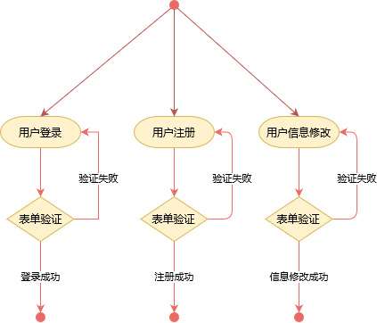
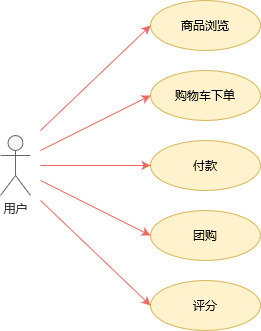

1. 用户角度

   1.1 账号管理

   

   ​	1.1.1 用户登录：用户输入用户名、密码和验证码，若匹配则执行登录操作。

   ​	1.1.2 用户注册：用户填写基本信息，包括用户名、密码、手机号、邮箱等，若用户名可用则执行注册操作。

   ​	1.1.3 修改个人信息：用户可对自己的信息进行修改。

   

   ​	1.2 商城功能

   

   ​		1.2.1 商品浏览：用户有权限对商城中的商品进行浏览。

   ​		1.2.2 购物车下单

   ​		1.2.3 付款

   ​		1.2.4 团购

   ​		1.2.5 评分

2. 管理员角度

   2.1 用户管理

   2.2 订单管理

   2.3 商品管理